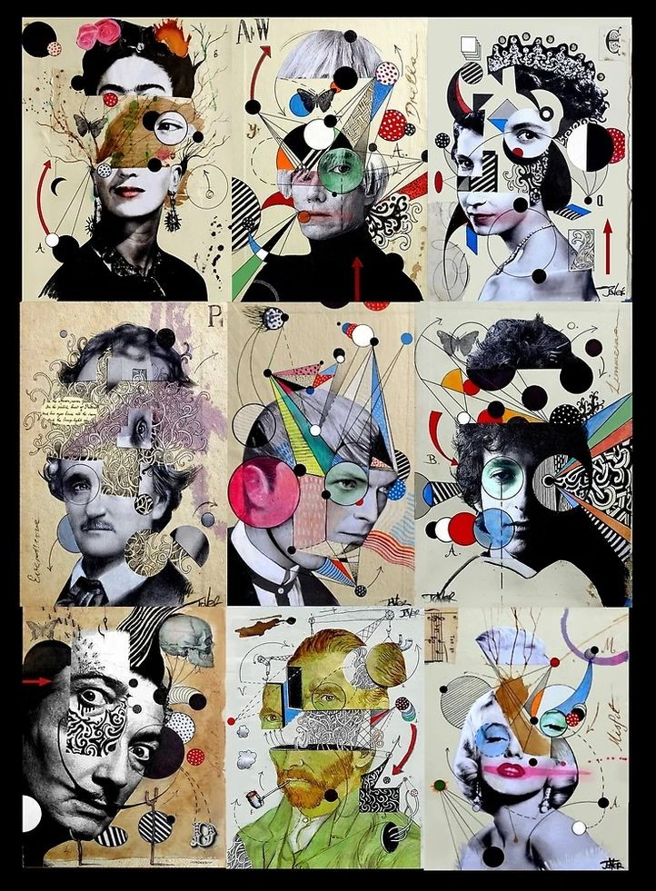
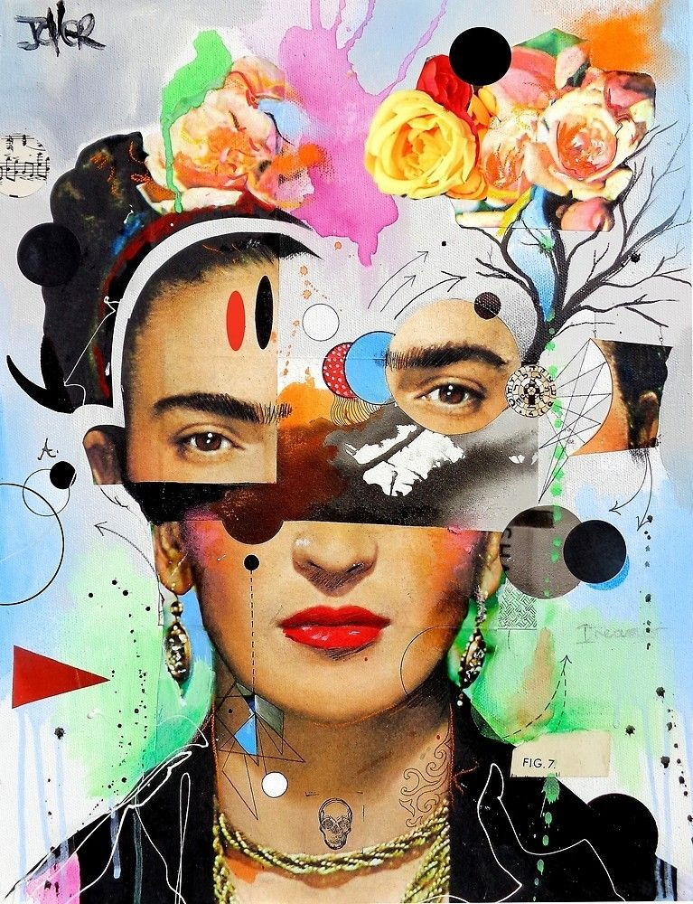
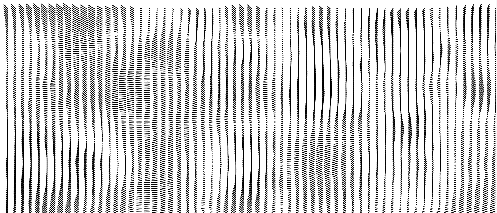
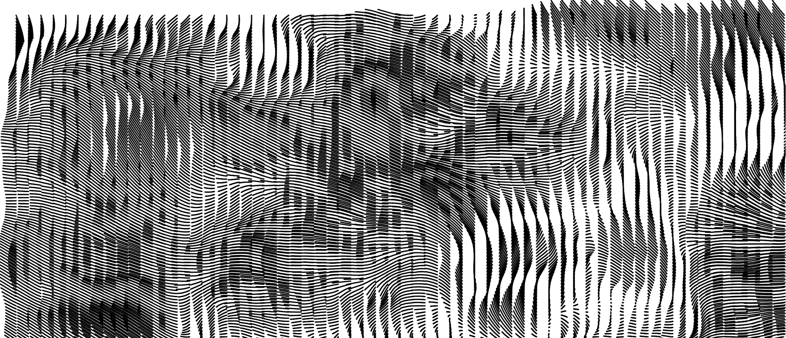
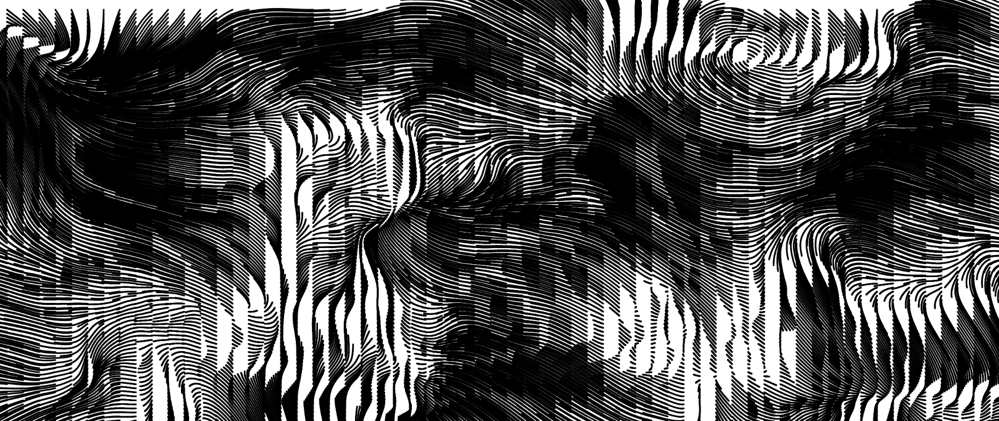
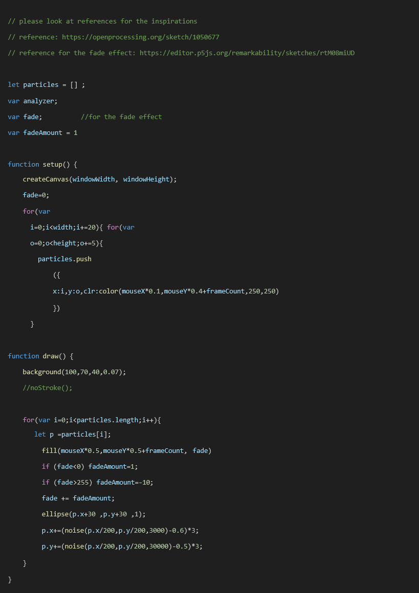

# **jdin0045 Week 8 Quiz**
## Part 1 Imaging Technique Inspiration
My inspiration comes from Loui Jover's work "9 deconstructions". He divides and moves paintings or photographs, while the space between subsets and subjects is connected by elements such as points, lines and planes. Through the re-creation of classic works can form a new, rich level and artistic visual effect. Based on this visual representation, I will set the interaction between the elements and the mouse, giving the audience the opportunity to create rather than directly showing a fixed image. This not only presents a unique visual experience, but also helps encourage them to be creative.

#### *Loui Jover's work "9 deconstructions" ↓*

## Part 2 Coding Technique Exploration
In order to make the visual effect of the work more vivid, the planar elements can be upgraded to dynamic elements, such as different textures and brushstrokes. I found a coding technique called ["Oil Spill"](https://openprocessing.org/sketch/2308489), which enables the creation of different brush strokes, from points to lines and eventually to planes, to achieve a sense of flow of elements. To achieve the integrity of the picture can be set on the basis of the specific scope of effect. In addition, it is important to use a combination of dynamic and planar elements, which can avoid clutter in the picture. 
#### *First stage change ↓*

#### *Second stage change ↓*

#### *Third stage change ↓*

#### *Sample Code ↓*

